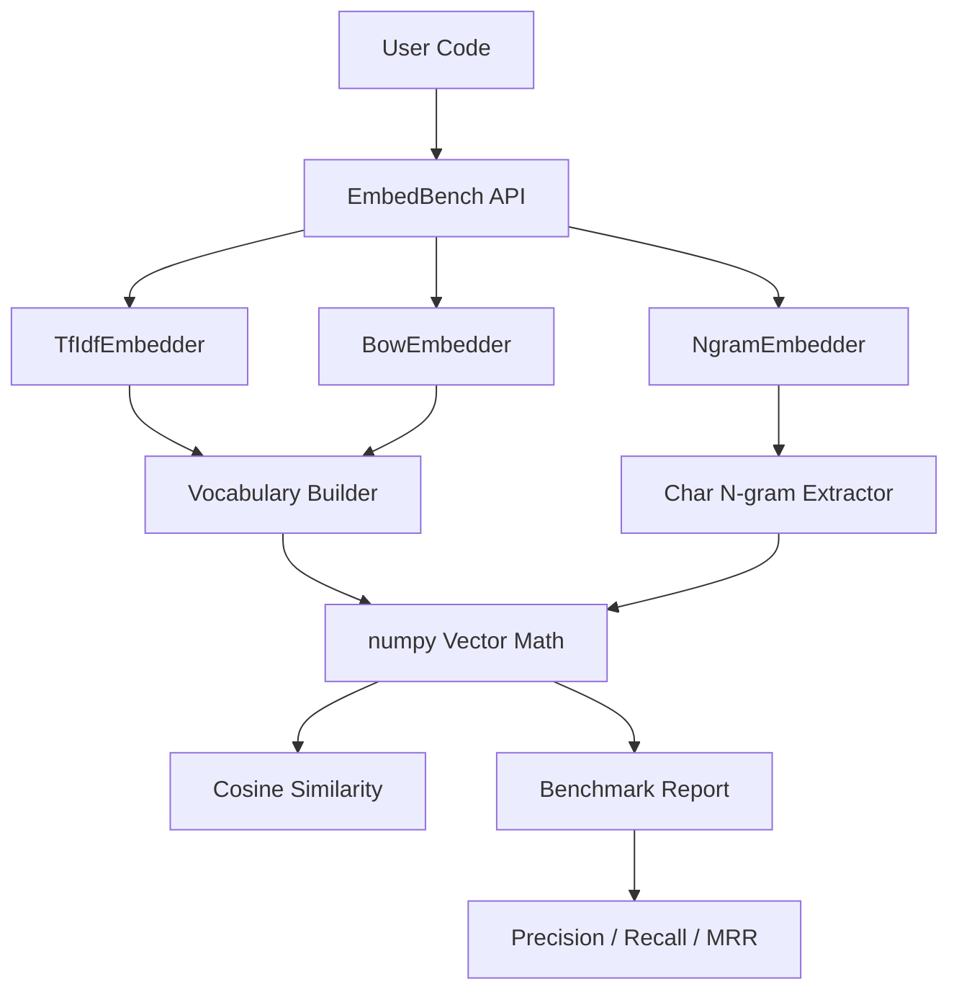

# EmbedBench

[](https://github.com/officethree/EmbedBench/actions/workflows/ci.yml)
[](https://www.python.org/downloads/)
[](LICENSE)
[](https://github.com/psf/black)

**Embedding model comparison toolkit** — a Python library for benchmarking and comparing text embedding quality across different approaches (TF-IDF, bag-of-words, character n-grams).

## Architecture



## Quickstart

### Installation

```bash
pip install -e .
```

### Basic Usage

```python
from embedbench import TfIdfEmbedder, BowEmbedder, NgramEmbedder, EmbedBench

# Embed text with TF-IDF
embedder = TfIdfEmbedder()
embedder.fit(["the cat sat on the mat", "the dog chased the cat"])
vec = embedder.embed("cat sat")

# Compare two texts
similarity = embedder.compare("the cat sat", "the dog chased")
print(f"Similarity: {similarity:.4f}")

# Benchmark retrieval across all embedders
bench = EmbedBench()
corpus = [
    "machine learning algorithms",
    "deep neural networks",
    "natural language processing",
    "computer vision models",
]
queries = ["neural network training"]
relevance = {0: [1]}  # query 0 is relevant to doc 1

report = bench.benchmark(corpus, queries, relevance)
print(report)
```

### Run the Benchmark Report

```python
from embedbench import EmbedBench

bench = EmbedBench()
corpus = ["doc one", "doc two", "doc three"]
queries = ["one", "two"]
relevance = {0: [0], 1: [1]}

bench.benchmark(corpus, queries, relevance)
print(bench.get_report())
```

## Features

- **TF-IDF Embeddings** — term frequency-inverse document frequency vectors
- **Bag-of-Words Embeddings** — simple word count vectors
- **Character N-gram Embeddings** — sub-word level representations
- **Cosine Similarity** — compare any two texts
- **Retrieval Benchmarking** — precision, recall, and MRR metrics
- **Pydantic Configuration** — type-safe, validated settings
- **Zero external API calls** — everything runs locally with numpy

## Development

```bash
make install    # install in dev mode
make test       # run tests
make lint       # run linter
make format     # auto-format code
```

## Inspired by embedding and RAG evaluation trends

---

Built by **Officethree Technologies** | Made with love and AI
